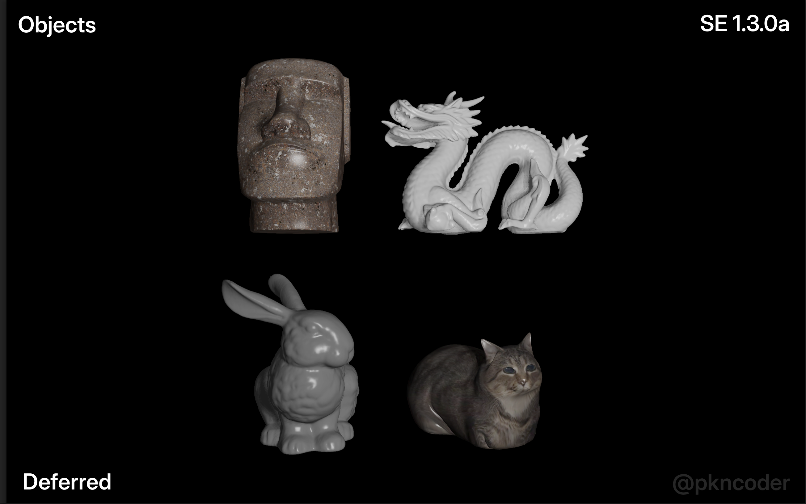
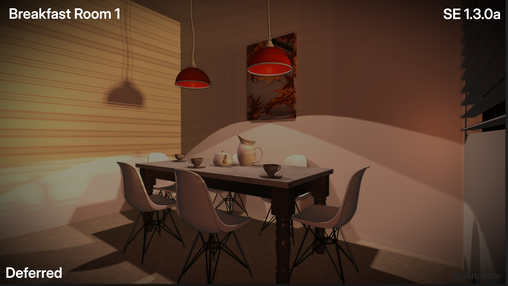
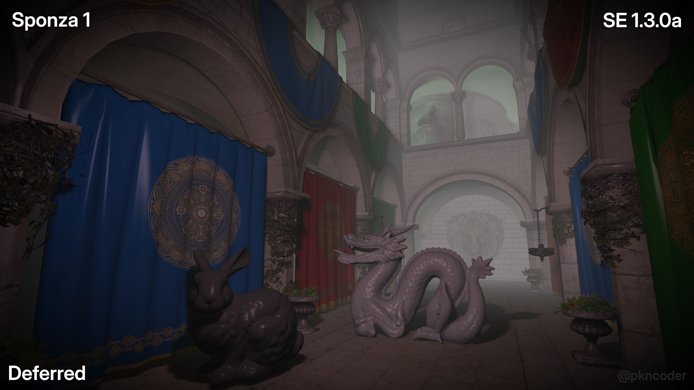
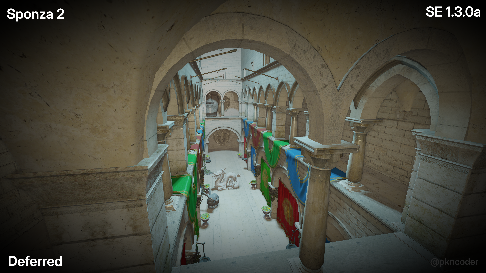
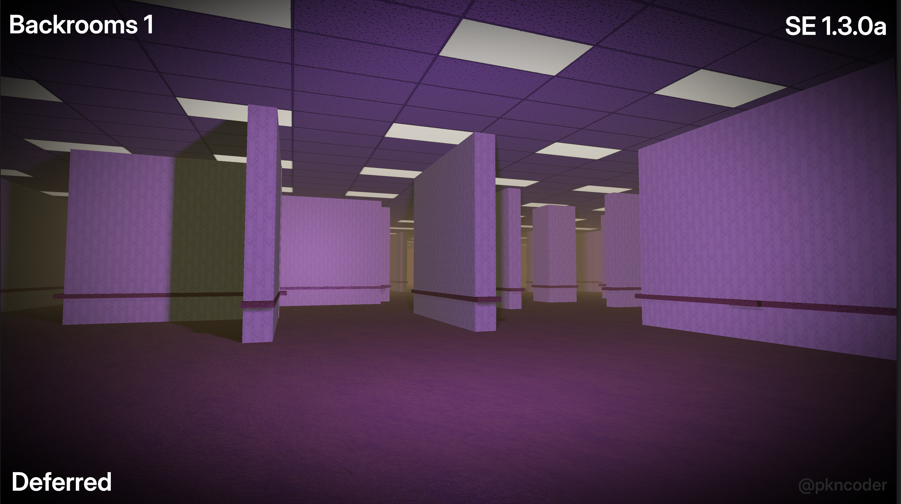
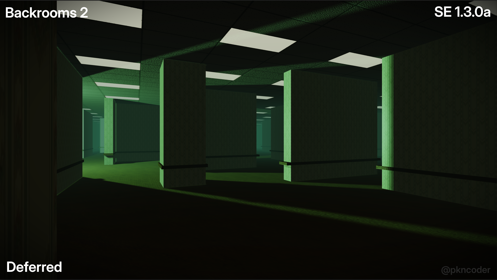
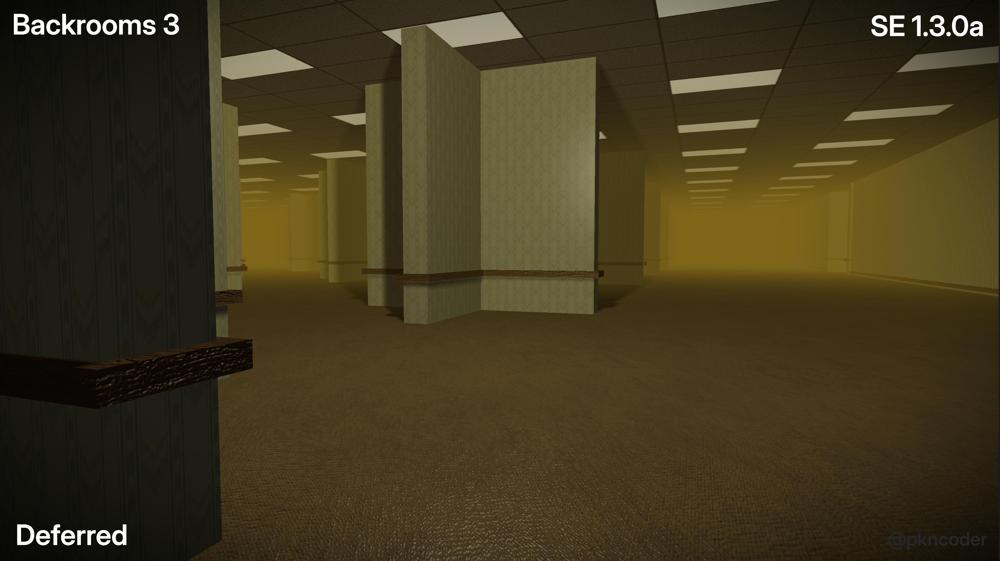
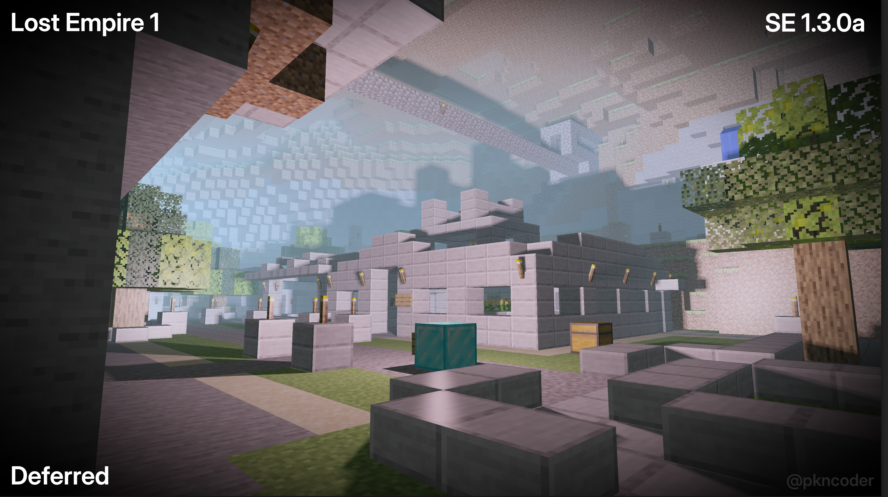
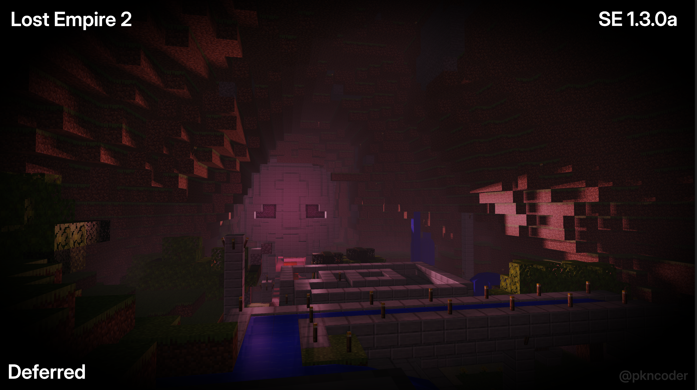

<h1 align="center">⛭  Tempname: Engine ⛭</h1>
<p align="center">A Crossplatform - GPU Multi-Level Rendering Tool</p>
<p align="center"></img></p>

## ☀️ Overview

Tempname: Engine is an application that has the plan for something not seen very often. On a high level, Tempname: Engine is a GPU-Renderer that will have model, scene, and material modifications. This, however, is not the main point.

Tempname: Engine will use the built scene and render it out in a varriety of methods. Instead of having the basic Rasterizer or minimal Render Graph, Tempname: Engine will include multiple-different renderers. Some of these include:
- Rasterizer
- Deferred Rendering
- Ray Tracer
- Path Tracer
- Ray Marcher
- Ray Caster (Voxels)

Along with these, the user will have the utilities to render out stylized scenes to their modifications, and have the ability for simple animations & scene creation.

## ✨ Features

### Current

- Renderers
  - Deferred Shader w/ Basic Render Graph
    - Shadows
    - G-Buffer
    - Lighting
- Moveable camera
- Entity Component System (ECS) using EnTT
  - MeshComponent
  - TransformComponent
  - MaterialComponent
  - CameraComponent
  - PointLightCompoment
- Object Materials
  - Albedo/Emmissive
  - Roughness/Metallic
- .obj, .mat, and texture file loading
- Terminal logger w/ scrolling information & an updating "dashboard"
  - Log level/type + Tags
  - Scrolling/stacked logging & In-place or dynamic text
  - ASCI colors

### Planned /  To-Be-Made

- Renderers
  - Ray Tracer \*
  - Ray Marcher \*
  - Ray Caster (Voxels) \*
- Larger material support
- Full editor for scene and render modifications
- Multi-render pass support \*
- Multi-renderer image outputs (ex. rasterized scene, path traced reflections/shadows, ray marched clouds) \*
- Multi-threading
- Editable Render Graph

> \* OpenGL 4.6+ (not MacOS)

For more todos, ideas, and current capibilites, check out: [todo.md](todo.md).

## 🚀 Running

This project has been tested on:

- M2 Macbook Air (2022), running MacOS Sequoia 15.2
- Ryzen AI 9 HX 370 Framework 16 + NVIDIA GeForce RTX 5070 8G - On Fedora Linux 43/44 + Niri WM

Due to Apple's discontinuation OpenGL, some features are not supported on the OS. Plans for compatibility shaders are wrote down, however not being worked on.


## Option 1 (Recommended)

Go to the "Releases" page on this repo, and download the right one for your system.

### Linux (x86)

1. Download engine-linux-x86-1.3.1a.zip
2. Unzip the folder
3. Enable permissions to run it as a program (chmod +x engine)
4. Run "engine"

> I don't have a Linux ARM, so I can't compile it, sorry.

### Apple (Only Sillicon is Supported)

1. Download engine-apple-sillicon-1.3.1a.zip
2. Unzip the folder
3. Right-click on the "engine" application - click "open-anyways"

> Due to the application not being signed with an Apple Developer Account, this work-around is needed.

### Windows

1. Download engine-engine-x86-1.3.0a.zip
2. Unzip the folder
3. Run engine.exe

> Due to Powershell being stupid, the in-terminal logger won't work right unless you are running bash.

## Option 2 - Compile Yourself

### Step 1

Download & install cmake.

It is recommend using a package manager for Unix systems (ex. brew for MacOS or dnf for Fedora) or finding a YT video if you are unable/don't want to use a package manager, but here is the cmake's download page if you want to do it the hard way: [Cmake Downloads](https://cmake.org/download/).

### Step 2

Download & install vcpkg.

Copy down the repo & cd into it:

```
git clone https://github.com/microsoft/vcpkg.git
cd vcpkg
```

Run the install script based on your system:

- Windows:

```
.\bootstrap-vcpkg.bat
```

- MacOS/Linux

```
./bootstrap-vcpkg.sh
```

### Step 3

Clone down this repo in the terminal and cd into it:

```
git clone https://github.com/pkncoder/Light-Teachings.git && cd ./Engine/
```

### Step 4

If you are using bash/zsh/similar syntax terminal langauges, you can run the "run" script like this:

```
./run
```

If that does not work, you can compile it yourself like this:

```
cmake -B build -S . -DCMAKE_TOOLCHAIN_FILE=$HOME/.vcpkg/scripts/buildsystems/vcpkg.cmake -DCMAKE_EXPORT_COMPILE_COMMANDS=ON
cmake --build build
```

And then run it:

```
./build/bin/engine
```

## ⚙️ Usage

To control the scene, WASD can be used for movement, and holding right click will move the camera's looking direction.
C will print out the current camera position in the terminal.
R will reload the scene to the state of activeScene.json.

To change the rendered model:
1. Create a new folder that will hold your mesh, materials, and textures in assets/
2. Find & open activeScene.json
3. Edit "projectDirectory" to "assets/{insert your folder}/"
4. Edit "objFile" to "{.obj file name}.obj"
5. Save the file
6. Either re-open the application, or press "r" to reload it during runtime

## 💻 Technologies

- **IDE** - Neovim + LazyVim
- **Languages** - CPP, GLSL, CMake
- **UI/UX & Window Library** - Dear ImGUI & GLFW3
- **Rendering API** - OpenGL
- **Rendering Library** - GLAD
- **Rendering Methods** - Deferred
- **Entity Component System** - EnTT

## 📝 Documentation

Currently, there is no live specific documentation, but there is still some files in the project:

- [fileTree.txt](fileTree.txt) - Stores a file tree of current & planned files/directories w/ explanations of their purpose.
- [todo.md](todo.md) - Stores not only current todos, but all completed todos, project goals, etc.
- [tags.md](tags.md) - Basic text file with the explanatin of what each tag does when it appears in the Logger service
- [RESOURCES.md](RESOURCES.md) - Stores the resources used in creation & any important "shout-outs" linked.

## 🌌 Gallery

<table>
  <tr>
    <td align="center" valign="middle">
      
    </td>
    <td align="center" valign="middle">
      
    </td>
    <td align="center" valign="middle">
      
    </td>
  </tr>
  <tr>
    <td align="center" valign="middle">
      
    </td>
    <td align="center" valign="middle">
      
    </td>
    <td align="center" valign="middle">
      
    </td>
  </tr>
  <tr>
    <td align="center" valign="middle">
      
    </td>
    <td align="center" valign="middle">
      
    </td>
    <td align="center" valign="middle">
      
    </td>
  </tr>
</table>

## 🛝 Demos

The renderers included in Tempname: Engine (not including the rasterizer) were first built and made on a website called [shadertoy](https://www.shadertoy.com), which is an online OpenGL shader runner. It uses WebGL. Here are all the current online demos of those renderers:

- Ray Tracer: [Ray Traced Glass and Shiny](https://www.shadertoy.com/view/tXyXRc)
- Path Tracer: [Almost Real-Time Path Tracer](https://www.shadertoy.com/view/7fBSzR)
- Ray Marcher is in the works

*Note: Some of these may not be completed, or fully/at all implemented in Tempname: Engine yet.*

## 📚 Resources Used

<!-- TODO: ADD HIGHLIGHTS -->

For a full list of resources used, see [RESOURCES.md](RESOURCES.md)

## ✒️ License

This project is protected under the [MIT](LICENSE) License.
